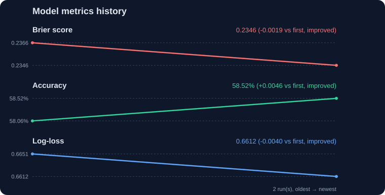

# MLB Game Prediction Engine

Predicts the winner of MLB games. It pulls real team and starting-pitcher stats,
runs them through a C++ prediction engine, and outputs a win probability for each
matchup. The model **teaches itself** — it learns its weights from past seasons
of real results instead of using hand-picked numbers.

## What it does

- Gathers team stats (batting, pitching, fielding) and each game's probable
  starting pitcher.
- Predicts a win probability for every game on today's schedule.
- Learns its own weights by training on real historical games (you pick the
  seasons).
- Can check its own accuracy against actual results from any season.

## Setup

You need **Python 3.7+**, a **g++** compiler on your PATH, and an internet
connection.

```bash
git clone https://github.com/ConnorYelle/gamePredict.git
cd gamePredict
```

## How to use it

### 1. Get today's predictions

```bash
python runPipeline.py
```

This runs everything: collects stats, fetches today's games and starters,
builds the C++ engine, and prints predictions. Results are saved in `outputs/`.

### 2. Let the model teach itself

```bash
python scripts/train_weights.py
```

Trains on past seasons of real games and writes the learned weights to
`config.json`. Future predictions automatically use them. Run it again any time
to re-learn from newer data.

### 3. Check how accurate it is

```bash
python scripts/validate_predictions.py --backtest
```

Replays a whole season of real games and reports how often the model was right,
versus just always picking the home team.

## Choosing the season

Yes — the season is a flag you can change whenever you want.

**Training** (`train_weights.py`):

```bash
# Train on 2024, test on 2025 (the default)
python scripts/train_weights.py

# Train on multiple seasons
python scripts/train_weights.py --train-seasons 2022,2023,2024 --val-season 2025

# Preview results without saving the weights
python scripts/train_weights.py --dry-run

# Ignore starting pitchers (team stats only)
python scripts/train_weights.py --no-pitchers
```

**Backtesting** (`validate_predictions.py --backtest`):

```bash
# Pick the season and date range
python scripts/validate_predictions.py --backtest --season 2023
python scripts/validate_predictions.py --backtest --season 2025 --start 2025-05-01 --end 2025-10-31

# Skip starting pitchers
python scripts/validate_predictions.py --backtest --no-pitchers
```

## All the commands

| Command | What it does |
|---|---|
| `python runPipeline.py` | Run the full pipeline and print today's predictions |
| `python scripts/train_weights.py` | Learn weights from past seasons → `config.json` |
| `python scripts/validate_predictions.py --backtest` | Measure accuracy against a real season |
| `python scripts/statsCollector.py` | Collect team batting/pitching/fielding stats |
| `python scripts/scheduleFetcher.py` | Fetch today's games + probable starters → `games.txt` |
| `python scripts/collect_pitchers.py` | Fetch starting-pitcher stats → `StartingPitchers.csv` |

Common flags: `--season` / `--start` / `--end` (backtest window), `--train-seasons` / `--val-season` (training seasons), `--no-pitchers` (team stats only), `--dry-run` (don't save). Add `-h` to any command to see its options.

## How the prediction works

Each team gets a strength score from three parts — offense (R/G, OBP, SLG),
defense (RA/G, fielding %), and its starting pitcher (ERA, WHIP, K/9, plus recent
form). The home team gets a small home-field bump. The win probability is the
home team's share of the combined strength:

```text
strength     = offense + defense + startingPitcher
probability  = homeStrength / (homeStrength + awayStrength)
```

The "weights" that decide how much each stat matters live in `config.json` and
are set by the trainer. If a game's starter isn't announced yet, the pitcher part
is skipped and the model uses team stats only.

## Where things go

- `outputs/` — predictions, reports, and social posts
- `data/rawData/<date>/` — the stats used for that day's predictions
- `data/cache/` — saved API responses, so repeat runs are fast
- `config.json` — the model's learned weights

## Latest validation

<!-- METRICS-START -->
Run `python scripts/validate_predictions.py --backtest` to generate results.
<!-- METRICS-END -->

## Metrics history

How accuracy, Brier score, and log-loss have moved across model changes. Each
training (`train_weights.py`) or tracking (`track_metrics.py`) run appends a row
to `data/metrics_history.jsonl`; regenerate this chart with
`python scripts/plot_metrics_history.py`.

<!-- METRICS-HISTORY-START -->



_Latest (train [2022, 2023, 2024] -> val 2025, git `465e6d0*`): accuracy 58.52% · Brier 0.2346 · log-loss 0.6612 — 2 run(s) recorded._

<!-- METRICS-HISTORY-END -->
